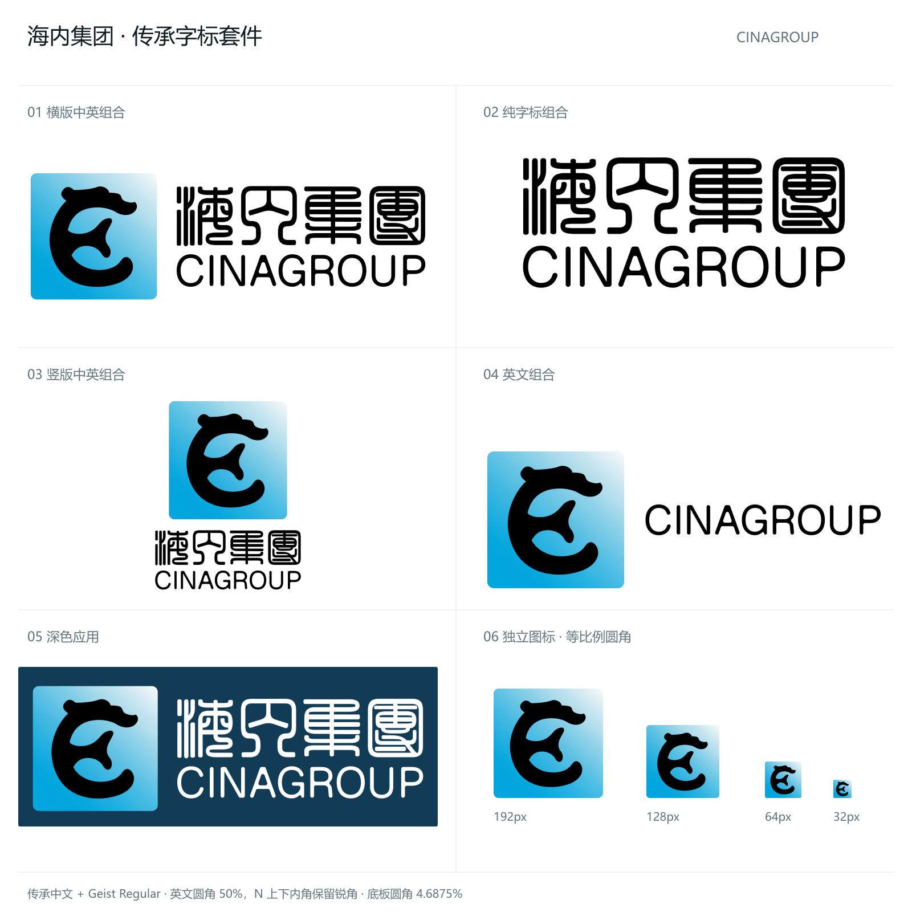

# 海内集团 CinaGroup Brand

海内集团官方通用品牌资产仓库。当前集团标准为 **v2.1.1 传承中文 + Geist 英文**：保留原始左侧图案、蓝色渐变与中文字形，英文 CINAGROUP 使用 **Geist Regular** 轮廓，尖角采用主笔画宽度 **50%** 的圆角半径，**N 字上下内侧的两处锐角保留原状**。中英双行组合等宽、左右对齐，蓝色底板采用边长 **4.6875%** 的等比例圆角。



## 传承字标套件

| 用途 | PNG | SVG | 原生尺寸 |
| --- | --- | --- | --- |
| 横版中英组合 | [下载](assets/heritage/cinagroup-horizontal.png) | [下载](assets/heritage/cinagroup-horizontal.svg) | 3328 × 1152 |
| 竖版中英组合 | [下载](assets/heritage/cinagroup-stacked.png) | [下载](assets/heritage/cinagroup-stacked.svg) | 1408 × 1664 |
| 英文组合 | [下载](assets/heritage/cinagroup-english.png) | [下载](assets/heritage/cinagroup-english.svg) | 3072 × 1152 |
| 纯字标组合 | [下载](assets/heritage/cinagroup-wordmark.png) | [下载](assets/heritage/cinagroup-wordmark.svg) | 2176 × 960 |

每种组合还提供 `-white` 文字反白版本，以及四分之一宽度的 PNG，例如 [`cinagroup-horizontal-832.png`](assets/heritage/cinagroup-horizontal-832.png)。全部组合保留左侧全彩原图；反白版本仅改变文字颜色。组合 SVG 自包含图形和中文位图，英文采用矢量路径；**整张组合不是纯矢量稿**，显示时不依赖本机字体。

独立素材：[左侧原图](assets/heritage/cinagroup-symbol-source.png)、[中文原字标](assets/heritage/cinagroup-wordmark-zh.png)、[Geist 圆角英文 PNG](assets/heritage/cinagroup-wordmark-en.png)、[英文纯矢量 SVG](assets/heritage/cinagroup-wordmark-en.svg)。完整文件、尺寸与校验值见 [套件清单](assets/heritage/manifest.json)。

英文采用官方 Geist v1.7.2 的 Regular（400）字重；以大写 I 的 86 字体单位笔画为基准，圆角半径为 43 单位。狭窄接点局部缩小半径，避免相邻圆角重叠。字体、来源校验值与 OFL 许可证保存在 [字体源目录](sources/fonts/geist/README.md)。

## 独立图标

- **等比例圆角图标**：[`assets/icons/rounded/`](assets/icons/rounded/)，包含 16、24、32、48、64、96、128、180、192、256、512、1024px。圆角半径为边长的 4.6875%，例如 256px 对应 12px、512px 对应 24px、1024px 对应 48px。
- **Web favicon**：[`favicon.ico`](assets/icons/web/favicon.ico)，内含 16、20、24、32、40、48、64、128、256px；另有 [16px PNG](assets/icons/web/favicon-16.png) / [32px PNG](assets/icons/web/favicon-32.png)。
- **Windows**：[`cinagroup.ico`](assets/icons/windows/cinagroup.ico)，九种尺寸。
- **Apple Touch Icon**：[180px](assets/icons/web/apple-touch-icon.png)，完整方形，交由系统裁切。
- **PWA**：[192px](assets/icons/web/pwa-192.png) / [512px](assets/icons/web/pwa-512.png)，普通方形图标，不作为专用 maskable 安全区图标。
- **应用原图**：[1024px](assets/icons/app/cinagroup-app-icon-1024.png)，完整方形。
- 256px 文件：[完整方形](assets/logo/cinagroup-logo.png) / [标准圆角](assets/logo/cinagroup-logo-rounded.png)。[固定 3px 文件](assets/logo/cinagroup-logo-rounded-3px.png)仅作为历史兼容版本。

## 固定版本引用

```html

<link rel="icon" href="https://cdn.jsdelivr.net/gh/cinagroup/cinabrand@v2.1.1/assets/icons/web/favicon.ico">
<link rel="apple-touch-icon" href="https://cdn.jsdelivr.net/gh/cinagroup/cinabrand@v2.1.1/assets/icons/web/apple-touch-icon.png">
```

圆角随图形整体缩放，保持相同视觉比例。网页使用独立方形原图时，对正方形容器设置 `border-radius: 4.6875%; overflow: hidden;`；不要对整张组合 Logo 再做裁切。生产项目建议固定版本并在构建时复制资源；离线应用不在运行时依赖 CDN。

## 规范与复现

- [品牌使用规范](BRAND_GUIDELINES.md)：组合、名称、圆角、留白与兼容说明。
- [品牌资产政策](BRAND_POLICY.md)：使用授权。
- [机器可读清单](brand.json) / [SHA-256 清单](checksums.sha256)。
- [核准原稿](sources/heritage/cinagroup_20251026.png)：从用户提供的无损 PNG 保留。
- [生成脚本](scripts/build-heritage.mjs)：从核准图形、中文原稿和固定版本 Geist 字体生成资产。
- [英文轮廓生成器](scripts/geist-wordmark.mjs)：保留字距，以相切圆弧处理英文尖角。
- [CinaSeek 产品契约](products/cinaseek/brand.json)、[术语映射](products/cinaseek/terminology.json)、[界面 Token](products/cinaseek/tokens.css)。

```bash
pnpm install --frozen-lockfile
pnpm build
pnpm test
```

v1.x 标签保留此前发布的图标。历史单色文件继续保留供兼容使用，不属于本次全彩传承套件的新核准稿。
